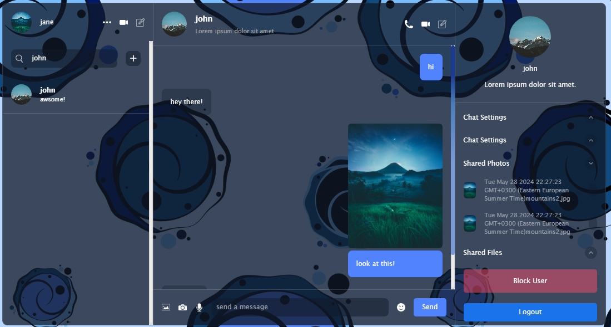

# Chat app with React & Firebase

This is a chat application between 2 users similar to WhatsApp.
In this app, the user can send and receive text messages, images, add and block other users.
The communication between the two users is done in the real time.

Technologies used: React, Firebase, Tailwind, Zustand  
Live demo: https://m-mohammad25.github.io/Chat-app-with-React-Firebase/
